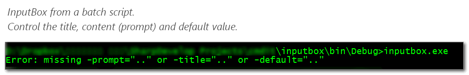
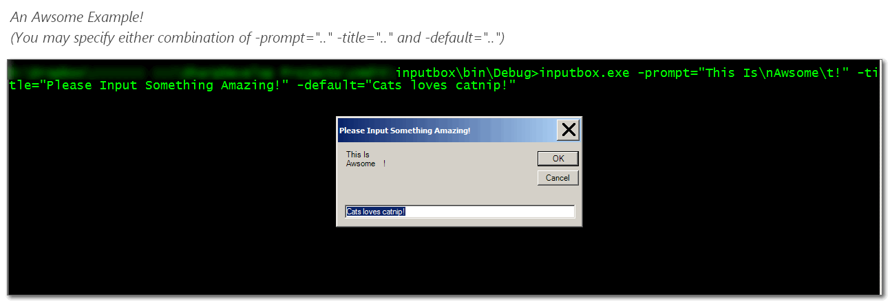
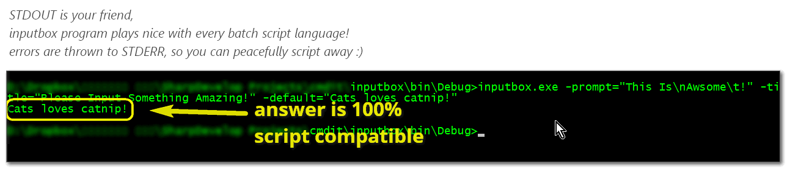

# C# InputBox
A simple and easy way of capturing the user's input,
Use it in batch scripts instead of usual standard-key-input which not always clear for users,

The inputbox application works with every console application, you can customize its content, title and default value (thus saving typing), it takes focus and waits for input from the user in a more friendly way than the standard-key input could ever be.

Yet is so simple to embed into script, 
you would not know how you've managed before without it.





here is a way of importing the value from the inputbox into a cmd variable using `set`
```CMD
for /f "tokens=*" %%a in (
  'inputbox.exe -prompt="my content here" -title="my title" -default="my default value"'
) do (
  set myvalue=%%a
);
```
now you can do "whatever" with `%myvalue%` :)

looking for a numeric input? no problem!

```CMD
for /f "tokens=*" %%a in (
  'inputbox.exe -prompt="my content here" -title="my title" -default="1024"'
) do (
  set /a myvalue=%%a
);

set /a timestwo=%myvalue%*2
```

the `set /a` helps you store the value (if it is no numerical it will be `0`) and even make some calculation with.

that is the simplest way of batch script usage,
naturally you can feed it to perl, python, even nodejs or use it with any program that takes argument.

for example if you'll run `chrome.exe` with single input of `google.com` it will be open up in a new tab, don't know what it could be used else.. for..
I'm using it for several custom scripts :)

hope it helps anyone,
feel free to review the code, fork or suggest improvements :))

<sub><a target="_blank" href="https://paypal.me/e1adkarak0" rel="nofollow"></a></sub>
